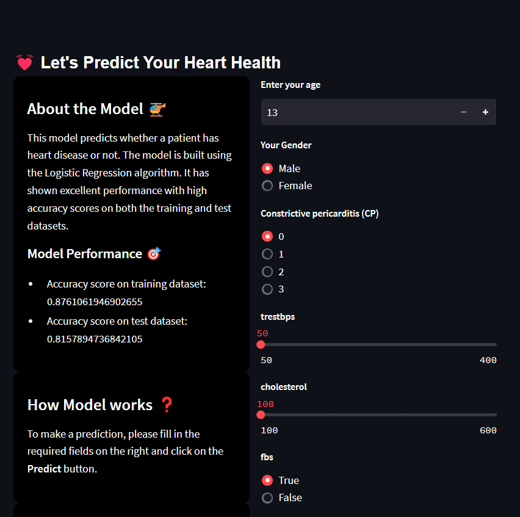

# Streamlit-heart_health
> Our Streamlit web application employs a machine learning model that utilizes various features associated with heart health to accurately predict whether an individual has a heart disease or not. By inputting relevant health information, such as blood pressure, cholesterol levels, age, and other critical indicators, the model generates real-time predictions with high precision. The user-friendly interface of the web app allows users to easily access and interpret the results, enabling them to make informed decisions about their cardiac health. This tool serves as a valuable aid in early detection and prevention of heart diseases, ultimately promoting better overall well-being.

## Link to the backend file 🗄️
https://github.com/codedestructed007/Streamlit-heart_health/blob/master/health_backend.ipynb

## Website Link:

Visit the live web app: link will be updated soon....

